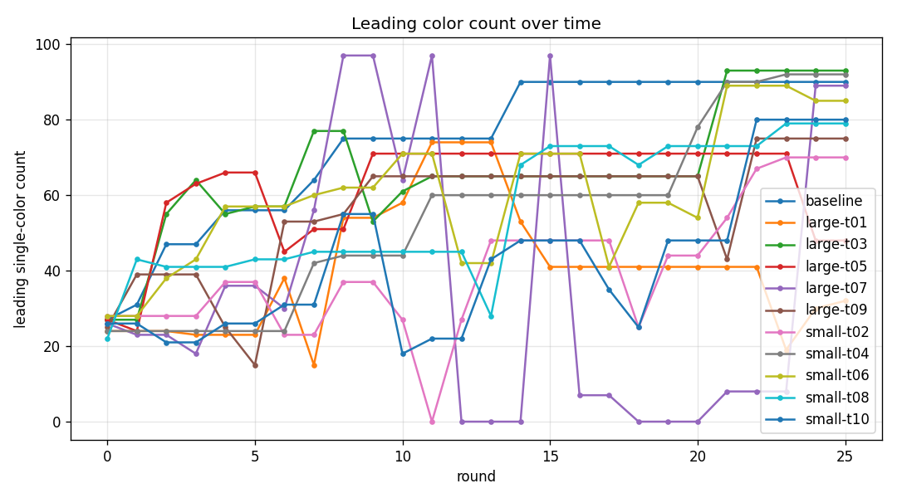
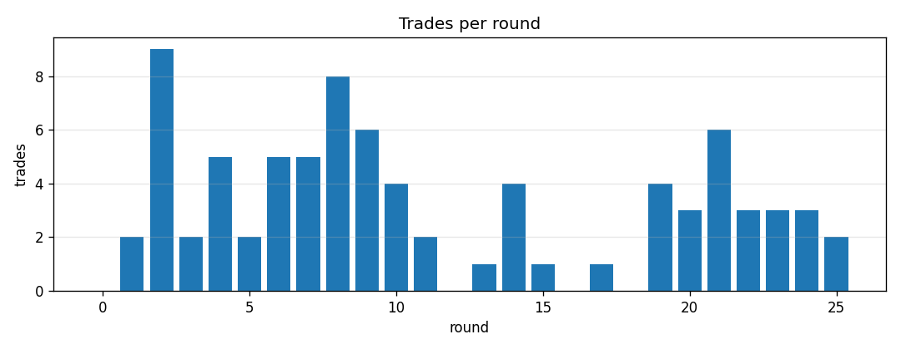
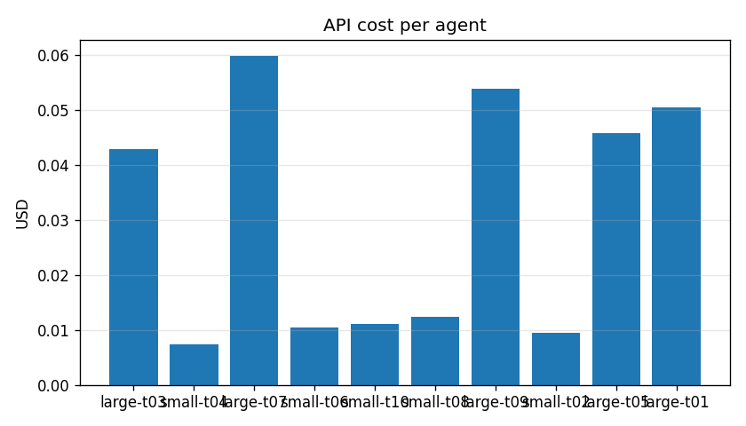

# Skittles Exchange — Temperatur-Studie mit Mistral

**Ein Junior-AI-Research-Bericht**
Datum: 2026-06-04 · Lauf-ID: `runs/20260604-090225` · Seed: 42

---

## TL;DR

Zehn LLM-Trader (5× `mistral-large`, 5× `mistral-small`, je eigene Temperatur)
plus eine regelbasierte Kontrollgruppe handelten über 25 Runden Skittles an einer
Börse mit Gebühr. **Gewonnen hat `large-t03` (mistral-large, Temperatur 0.3) mit
93× Gelb.** Die drei wichtigsten Befunde:

1. **Frühe Festlegung schlägt Cleverness.** Der Sieger wählte in Runde 1 eine
   Zielfarbe und hielt sie 25 Runden konsequent durch. Der schwächste Agent
   wechselte ständig das Ziel.
2. **Das kleinere Modell war im Schnitt besser — und 5× günstiger.**
   `mistral-small` erreichte im Mittel 81.2 führende Skittles, `mistral-large`
   nur 68.8, bei rund einem Fünftel der Kosten.
3. **Der simple Baseline ist konkurrenzfähig:** Platz 3 mit 90× Orange, besser
   als der Durchschnitt aller großen Modelle.

---

## 1. Fragestellung

Das Experiment untersucht, **wie sich LLM-Agenten in einem kompetitiven
Markt-Setting verhalten**, wenn sie dasselbe Problem bekommen. Konkret:

- **F1 — Modellgröße:** Handelt `mistral-large` strategisch besser als
  `mistral-small`?
- **F2 — Temperatur:** Beeinflusst die Sampling-Temperatur die
  Handelsperformance?
- **F3 — Strategie:** Welche Strategien entstehen emergent, und welche gewinnt?
- **F4 — Baseline:** Schlagen die LLMs eine triviale regelbasierte Strategie?

## 2. Methode

### 2.1 Aufbau (2×5-faktorielles Design + Kontrolle)

Jeder Agent startet mit 100 zufällig (multinomial, seed-gesteuert) auf fünf
Farben verteilten Skittles. Ziel: am Ende möglichst viele Skittles **einer
einzigen Farbe** besitzen (welche ist egal). Es gibt **11 Teilnehmer**:

| Gruppe | Modell | Temperaturen |
|---|---|---|
| Large | `mistral-large-latest` | 0.1 · 0.3 · 0.5 · 0.7 · 0.9 |
| Small | `mistral-small-latest` | 0.2 · 0.4 · 0.6 · 0.8 · 1.0 |
| Kontrolle | regelbasierte Heuristik | — |

Die Temperaturen sind so gewählt, dass **jeder Agent eine eigene Temperatur**
hat und beide Modelle den vollen Bereich [0.1, 1.0] abdecken.

### 2.2 Markt-Mechanik

- **Börse mit Order-Book je Farbpaar** (kontinuierliche Doppelauktion,
  Preis-Zeit-Priorität). Kein Peer-to-Peer-Handel.
- Beim Eingeben einer Order werden die angebotenen Skittles **sofort gesperrt**
  (Escrow). Ausführung zum Maker-Preis.
- **Gebühr:** Die Börse behält 10 % von dem, was jede Seite *erhält* (abgerundet),
  im Tresor — der Umlauf sinkt also mit jedem Trade.
- Preise und Mengen sind ganzzahlig (keine Skittle-Bruchstücke).

### 2.3 Agenten-Autonomie

Die LLMs entscheiden **voll autonom über Tool-Calls** (`get_state`,
`view_markets`, `place_order`, `cancel_order`, `my_orders`, `end_turn`). Pro
Runde ein Zug, max. 10 Tool-Calls. Es wird **keine Historie über Runden hinweg**
mitgeführt — der Marktzustand selbst ist der persistente Speicher, den die
Agenten neu beobachten. Das hält die Kosten beschränkt und ist die eigentliche
Forschungsvariable.

### 2.4 Metriken

- **Primär:** höchster Einzelfarben-Bestand am Ende (= Score).
- Sekundär: Gesamtbestand, Trade-Beteiligung, API-Kosten, eingezogene Gebühren.

## 3. Ergebnisse

### 3.1 Endstand

| # | Agent | Modell | Temp | Score | Farbe | Gesamt | Trades | Kosten |
|---|---|---|---|---|---|---|---|---|
| 🥇 1 | `large-t03` | large | 0.3 | **93** | Gelb | 111 | 18 | $0.0430 |
| 🥈 2 | `small-t04` | small | 0.4 | 92 | Rot | 92 | 10 | $0.0074 |
| 🥉 3 | `baseline` | heur | — | 90 | Orange | 90 | 8 | $0.0000 |
| 4 | `large-t07` | large | 0.7 | 89 | Grün | 97 | 15 | $0.0598 |
| 5 | `small-t06` | small | 0.6 | 85 | Blau | 91 | 16 | $0.0104 |
| 6 | `small-t10` | small | 1.0 | 80 | Blau | 80 | 18 | $0.0110 |
| 7 | `small-t08` | small | 0.8 | 79 | Rot | 95 | 16 | $0.0123 |
| 8 | `large-t09` | large | 0.9 | 75 | Orange | 88 | 16 | $0.0540 |
| 9 | `small-t02` | small | 0.2 | 70 | Grün | 79 | 11 | $0.0095 |
| 10 | `large-t05` | large | 0.5 | 55 | Gelb | 93 | 17 | $0.0458 |
| 11 | `large-t01` | large | 0.1 | 32 | Rot | 88 | 17 | $0.0505 |

**Lauf-Summen:** 81 Trades · Gesamtkosten $0.3038 · 96 Skittles im Gebühren-Tresor.
Erhaltung bestätigt: 1004 im Umlauf + 96 Tresor = 1100 Start (11 × 100).



### 3.2 Aggregat: Modellgröße (F1)

| Gruppe | Ø Score | Σ Kosten | Kosten/Score |
|---|---|---|---|
| `mistral-small` | **81.2** | $0.0507 | $0.0006 |
| `mistral-large` | 68.8 | $0.2530 | $0.0037 |
| `baseline` | 90.0 | $0.0000 | — |

Das **kleinere Modell schnitt im Schnitt besser ab** — und kostete pro
Score-Punkt rund **6× weniger**. Die große Streuung bei Large (Scores 32–93) zeigt
aber: nicht das Modell allein entscheidet, sondern die **Konsistenz der Strategie**.

### 3.3 Aggregat: Temperatur (F2)

Kein sauber monotoner Zusammenhang, aber ein Muster an den Rändern:

- **Sehr niedrige Temperatur war riskant:** `large-t01` (0.1) wurde mit Abstand
  Letzter (32). `small-t02` (0.2) war der schwächste Small (70).
- **Mittlere Temperaturen (0.3–0.6) dominierten** das obere Feld
  (`large-t03`, `small-t04`, `small-t06`).
- Hohe Temperaturen (0.8–1.0) lagen im Mittelfeld — mehr Zufall, aber kein
  klarer Nach- oder Vorteil.

> Interpretation: Niedrige Temperatur macht ein Modell deterministischer, schützt
> aber nicht vor einer *schlechten, dafür stur wiederholten* Argumentation
> (siehe `large-t01` in 3.4). Etwas Sampling-Vielfalt scheint zu helfen, aus
> unproduktiven Mustern auszubrechen.




## 4. Strategie-Analyse (F3)

Aus den von den Agenten mitgelieferten Begründungen lassen sich vier Archetypen
herausarbeiten.

### 4.1 Der Committer (Gewinner-Strategie) — `large-t03`

Wählte in Runde 1 **Gelb** (sowohl seine Anfangs-Führung als auch die
ranghöchste Farbe) und blieb 25 Runden konsequent dabei. Bereits in Runde 3
hatte es 64 Gelb.

> *„I currently lead in YELLOW (27), so I will focus on accumulating more
> YELLOW."* (Runde 1)
> *„I hold 64 YELLOW … all [other colors] locked in resting sell orders."*
> (Runde 3)

**Kein einziger Ziel-Wechsel.** Endbestand 111 (> 100!) — es hat durch günstige
Käufe netto sogar zugekauft.

### 4.2 Der aggressive Konverter — `small-t04`

Verkaufte früh und aggressiv alle Minderheitsfarben. Verstand die Gebühr explizit
und versuchte (manchmal mit überzogenen Preisen), effizient umzuwandeln.

> *„Placed aggressive SELL orders to convert all non-ORANGE skittles into
> ORANGE at favorable rates."* (Runde 2)

Wechselte später pragmatisch von Orange zu **Rot** und konsolidierte auf 92 — der
beste Wert ohne ein einziges teures Large-Modell.

### 4.3 Der Flip-Flopper (Verlierer-Strategie) — `large-t01`

Trotz niedrigster Temperatur (0.1, am deterministischsten) **wechselte es
ständig die Zielfarbe**: Runde 1 Grün, Runde 2 „consolidate into GREEN", Runde 3
plötzlich „I will pursue YELLOW instead".

> *„I will pursue YELLOW as my target color, as it is the highest-ranked…"*
> (Runde 3 — nach zwei Runden Grün-Strategie)

Das ständige Umorientieren zersplitterte den Bestand: Endstand nur **32**
führende Skittles bei 88 Gesamt — alles breit gestreut, nichts konsolidiert.

### 4.4 Der Über-Committer — `large-t07`

Sperrte wiederholt seinen **gesamten** Bestand in Orders (zwischenzeitlich 0
verfügbare Skittles), cancelte und platzierte dann neu — viel Order-Churn.

> *„I have 23 YELLOW … and zero available in the other four colors, but 77
> skittles locked in four resting sell orders."* (Runde 2)

Teuerster Agent ($0.0598, meiste Begründungen), erholte sich aber durch späte
Festlegung auf Grün zu Platz 4 (89).

## 5. Wer hat gewonnen — und warum?

**`large-t03` gewann, weil es als einziges drei Dinge kombinierte:**

1. **Frühe, stabile Festlegung.** Zielfarbe in Runde 1 gewählt, nie gewechselt —
   im Gegensatz zu `large-t01` und `large-t05`, die mäanderten.
2. **Kluge Farbwahl.** Gelb ist die *ranghöchste* Farbe. Da Märkte kanonisch
   `(base, quote)` orientiert sind, lässt sich eine ranghohe Farbe immer als
   `quote` (per SELL der anderen Farbe) ansammeln — ein struktureller Vorteil,
   den der Agent früh erkannte.
3. **Konsequentes Sperren der Minderheitsfarben** in Verkaufsorders zugunsten
   der Zielfarbe, statt zwischen Farben hin- und herzuhandeln (was nur Gebühren
   kostet).

Der entscheidende Unterschied zum Feld war **nicht** mehr Intelligenz oder mehr
Handel (es lag mit 18 Trades im Mittelfeld), sondern **Disziplin**: ein Plan,
durchgehalten über 25 Runden.

## 6. Diskussion

- **F1 (Modellgröße):** Überraschend gewann zwar ein Large-Modell, doch im
  *Mittel* war Small besser und drastisch günstiger. Die hohe Varianz bei Large
  deutet darauf hin, dass das größere Modell mehr „nachdenkt", dabei aber auch
  öfter seine Strategie überschreibt.
- **F2 (Temperatur):** Mittlere Temperaturen waren am robustesten; sehr niedrige
  Temperatur korrelierte hier mit dem schlechtesten Ergebnis.
- **F4 (Baseline):** Die triviale Heuristik (Platz 3, kostenlos) schlug 8 von 10
  LLM-Agenten beim Kosten-Nutzen-Verhältnis um Längen. Für diese einfache
  Konsolidierungs-Aufgabe ist ein LLM **nicht offensichtlich nötig** — ein
  wichtiger Realitäts-Check.
- **Gebühren-Ökonomie:** 96 von 1100 Skittles (8.7 %) verschwanden im Tresor,
  konzentriert in den beliebten Zielfarben Orange (28) und Gelb (22). Wer viel
  handelte, „verbrannte" mehr Umlauf — ein Anreiz gegen Über-Handeln, den der
  Sieger intuitiv beachtete.

## 7. Limitationen & Threats to Validity

- **n = 1 Lauf, 1 Seed.** Keine statistische Signifikanz. Die Rangfolge kann
  bei anderem Seed/Anfangsverteilung kippen. Für belastbare Aussagen bräuchte
  es ≥ 20 Läufe mit variierenden Seeds.
- **Konfundierung Modell × Temperatur:** Large und Small nutzen *unterschiedliche*
  Temperatur-Werte (0.1/0.3/… vs. 0.2/0.4/…), daher ist der Temperatur-Effekt
  nicht sauber vom Modell-Effekt trennbar.
- **Anonyme, gekoppelte Umgebung:** Die Agenten beeinflussen sich gegenseitig;
  ein „guter" Agent kann durch ein schwaches Feld bevorteilt sein.
- **Gleichgewichts-Effekt:** Sind alle Minderheitsfarben verkauft, versiegt der
  Handel (Farben wie Blau sind selten jemandes Ziel). Späte Runden tragen wenig
  zur Differenzierung bei.
- **Kein Gedächtnis:** Agenten „vergessen" frühere Runden — beobachtetes
  Flip-Flopping könnte teils Artefakt der zustandslosen Beobachtung sein.

## 8. Future Work

- **Wiederholung über viele Seeds** → Mittelwerte + Konfidenzintervalle.
- **Sauberes faktorielles Design:** gleiche Temperaturen für beide Modelle.
- **Gegner-homogene Läufe** (z. B. 11× dasselbe Modell) zur Trennung von
  Strategie- und Feld-Effekten.
- **Gedächtnis-Ablation:** Agenten mit Kurzzeit-Memo vs. zustandslos.
- **Andere Provider** (OpenAI, Anthropic) gegen Mistral im selben Markt.
- **Gebühren-Sweep:** wie verändert 0 % / 5 % / 20 % Gebühr das Handelsverhalten?

## 9. Reproduzierbarkeit

```bash
# Konfiguration: config/temp-study.yaml (seed 42, 25 Runden, fee_rate 0.1)
MISTRAL_API_KEY=… skittles run -c config/temp-study.yaml --verbose
python scripts/analyze.py runs/20260604-090225
```

Rohdaten im Lauf-Verzeichnis: `events.jsonl` (jede Order/Trade/Begründung),
`snapshots.jsonl` (Zustand je Runde), `report.json` (Kennzahlen). Seed und
Anfangsverteilung sind deterministisch; die LLM-Antworten sind es nicht — das
ist die untersuchte Variable.
